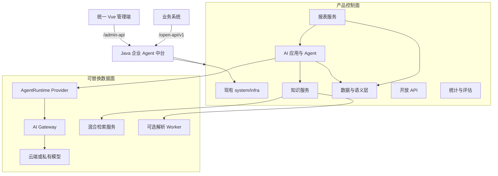
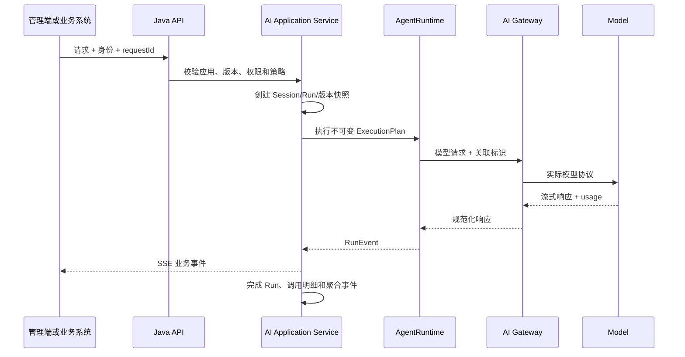
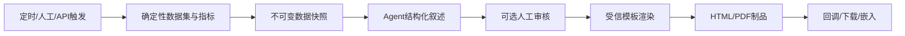

# 总体架构设计

## 架构原则

1. **控制面归产品。** 用户、权限、配置、版本、发布、审计、统计和开放协议由 Java 应用拥有。
2. **数据面可替换。** Agent Runtime、模型网关、检索和模型端点通过稳定端口接入。
3. **浏览器只信任 Java API。** 第三方服务不直接暴露给管理端或业务系统。
4. **确定性在外，生成在内。** 数据计算、权限、策略和渲染由代码执行，模型只处理受控上下文。
5. **发布版本不可变。** Agent、Workflow、Prompt、Skill、Tool、语义指标和报表运行都绑定具体版本。
6. **运行事件可重放。** 关键状态变化先形成持久记录或可靠事件，再投影统计和页面状态。

## 逻辑架构



## 控制面与数据面职责

| 能力 | 控制面事实源 | 数据面职责 |
| --- | --- | --- |
| 模型 | Provider、端点、别名、路由、价格、权限、统计 | 协议转换、转发、限流、熔断 |
| Agent | 定义、版本、发布、绑定、运行、审计 | 执行 ReAct/Graph、流式事件、中断恢复 |
| 知识 | 文档、版本、权限、任务、切片元数据、引用 | 解析、Embedding、全文/向量召回、重排 |
| 数据 | 数据源、对象、字段、指标、策略、查询审计 | 受控连接和只读查询 |
| 报表 | 定义、版本、任务、数据快照、制品、发布 | 可选浏览器渲染/PDF转换 |
| 观测 | 关联 ID、调用明细、聚合指标、评估结果 | OTel/网关/运行时原始信号 |

第三方组件保存其运行所需状态，但不得成为产品元数据的唯一来源。重建第三方组件后，控制面
应能根据已发布定义恢复必要配置和索引任务。

## 部署拓扑

### 最小生产拓扑

```text
reverse-proxy
├── basic-framework-admin static assets
└── basic-framework-server
    ├── MySQL 8
    ├── Redis 7
    ├── AI Gateway
    ├── hybrid search service
    └── model endpoints
```

Spring AI Alibaba 默认作为 Java 进程内依赖，不单独部署。文档解析先使用 Java 解析链；只有
格式覆盖、资源隔离或解析质量证明有必要时，才增加隔离 Worker。

所有内部组件只监听私网地址。AI Gateway、检索服务和模型端点使用独立服务身份，不接受管理端
用户 Token。生产环境由网络策略限制 Java 与各组件可访问的目的地址。

### 客户环境边界

- 每个客户独立数据库、Redis、密钥、文件和组件实例或逻辑集群。
- 部署包不包含客户真实模型密钥、数据源密码、内部地址和业务文档。
- 组件版本由产品版本矩阵锁定，禁止安装时隐式拉取 latest 镜像。
- 组件管理端默认不对客户普通用户开放；运维诊断经统一健康页和受审计命令完成。

## 关键链路

### Agent 同步流式调用



断开 SSE 不自动取消后台运行。调用方显式传 `disconnectPolicy=cancel` 且应用允许时才取消；否则
可以通过 Run 查询接口继续获取状态和最终结果。

### 知识入库

```text
文件登记
  -> 病毒/大小/类型校验
  -> 创建文档版本和索引任务
  -> Redis Stream 异步消费
  -> 解析与结构提取
  -> 切片和元数据生成
  -> Embedding
  -> 写入检索服务
  -> 原子切换活动索引版本
  -> 完成或进入有限重试/DLQ
```

新索引完成前旧版本继续服务。删除文档先撤销可检索状态，再异步删除数据面索引，避免删除窗口
继续召回。

### 受控数据查询

```text
自然语言或报表请求
  -> 选择已发布语义模型
  -> LLM 生成 QueryPlan JSON
  -> 对象/字段/指标权限检查
  -> 只读 SQL 编译
  -> SQL AST 策略检查
  -> 数据源只读连接执行
  -> 行数/时间/大小截断
  -> 结果脱敏与数据快照
  -> Agent 解释或报表渲染
```

模型永远不接收数据源凭证，也不能绕过 QueryPlan 和策略引擎直接向数据库发送字符串 SQL。

### 报表生成



模型叙述输出遵循 JSON Schema，例如摘要、风险、建议和引用，不接受原始 HTML。渲染器对文本转义，
只允许注册过的模板、图表类型和本地静态资源。

## 一致性策略

- 单个领域聚合内使用 MySQL 事务。
- 跨模块需要阻断的同步校验通过薄 API，在调用方事务内完成。
- 可延迟的索引、统计、回调和通知通过 Redis Stream，消费者使用稳定 `messageId` 幂等。
- 数据库提交与事件发布使用 Outbox；没有 Outbox 闭环前不得以“先写库再发消息”作为可靠契约。
- 外部调用不进入长数据库事务；先记录意图，调用后以显式状态机确认结果。
- 所有重试必须区分可重试与确定性失败，并设置次数、退避、截止时间和人工补偿入口。

## 扩展与替换

- `AgentRuntime` 接收产品定义的 `AgentExecutionPlan`，返回产品定义的 `RunEvent`。
- `ModelGateway` 接收规范化模型请求并返回统一 usage、错误和流式事件。
- `VectorSearch` 接收文档版本、Chunk、Embedding 和过滤条件，不暴露供应商查询 DSL。
- `DocumentParser` 接收文件引用，返回受版本控制的结构化文档块。
- `ReportRenderer` 接收模板版本、数据快照和结构化叙述，返回制品引用。

替换测试必须在不修改 AI、知识、数据和报表领域表的前提下切换 Provider。
