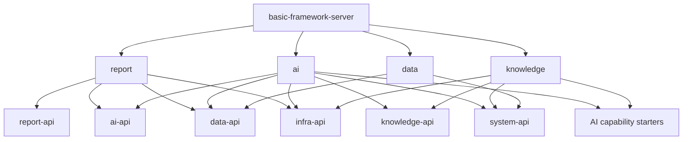

# 模块与依赖设计

## 后端目标布局

```text
basic-framework-boot/
├── basic-framework-module-ai-api
├── basic-framework-module-ai
├── basic-framework-module-knowledge-api
├── basic-framework-module-knowledge
├── basic-framework-module-data-api
├── basic-framework-module-data
├── basic-framework-module-report-api
├── basic-framework-module-report
└── basic-framework-core/
    ├── basic-framework-spring-boot-starter-agent-runtime
    ├── basic-framework-spring-boot-starter-model-gateway
    ├── basic-framework-spring-boot-starter-ai-observation
    └── basic-framework-spring-boot-starter-openapi-security
```

命名是目标设计，创建模块时仍须按仓库开发指南登记 BOM、父 POM、server 装配、ArchUnit 和测试。

## 业务模块所有权

### module-ai

拥有：

- 模型 Provider、端点、模型、路由、价格与调用统计；
- AI 应用、Agent、Workflow、Prompt、Skill、Harness 与发布版本；
- MCP Server、工具目录、工具快照和 Agent 绑定；
- Session、Message、Memory、Workspace、Run、Step 和 Checkpoint 引用；
- 评估数据集、评估器、实验和结果；
- 业务系统客户端与 AI 开放 API 资源授权。

消费 `knowledge-api` 和 `data-api`，把知识检索与受控查询注册为工具；不访问知识或数据模块的
Mapper、DO 和实现 Service。

### module-knowledge

拥有：

- 知识库、来源、文档、文档版本、解析、切片和索引任务；
- 检索配置、检索服务适配、引用和检索质量记录；
- 知识库访问范围和活动索引版本。

消费 `infra-api` 的文件契约和 system 当前身份/权限契约。不得依赖 `module-ai`；Embedding 请求经
`ModelGateway` 能力接缝完成，避免业务模块反向依赖。

### module-data

拥有：

- 外部数据源和加密凭证引用；
- Schema/Object/Field 元数据快照；
- 语义模型、维度、指标、关联、枚举和查询策略；
- QueryPlan 编译、只读执行、脱敏和查询审计。

不向其他模块暴露 JDBC、Mapper 或原始连接。公开契约只接受已授权语义模型、结构化 QueryPlan
或已发布指标请求。

### module-report

拥有：

- 报表定义、版本、模板、图表、调度、运行、审核、发布和制品引用；
- 报表数据快照及其来源摘要；
- 报表业务回调状态。

消费 `data-api` 获取确定性数据，消费 `ai-api` 运行分析 Agent，消费 `infra-api` 保存制品，消费
现有 Job 能力调度。报表模块是编排方，AI 和数据模块不反向依赖报表。

## 能力接缝

### starter-agent-runtime

对外契约：

- `AgentRuntime`：启动、恢复、取消和查询运行；
- `AgentExecutionPlan`：已解析、不可变、与供应商无关的运行计划；
- `RunEvent`：模型增量、工具开始/结束、状态变化、中断、错误和完成；
- `RuntimeCheckpoint`：运行时检查点的稳定引用和版本；
- `RuntimeCapabilities`：当前 Provider 支持的能力声明。

首个 Provider 包装 Spring AI Alibaba。SAA 的 `ReactAgent`、`CompiledGraph`、`OverAllState` 和
`RunnableConfig` 只存在于 Provider 内部包。

### starter-model-gateway

对外契约：

- Chat、Embedding、Rerank 三类请求分开；
- 同步与流式调用；
- 统一 `ModelUsage`、`ModelError` 和实际路由信息；
- 健康、能力发现和连接测试；
- 关联 ID、超时、取消和调用完成监听器。

Provider 可以直连 Spring AI 模型，也可以调用 Higress/LiteLLM。领域层只使用模型 ID 和路由 ID，
不保存外部网关的内部主键。

### starter-ai-observation

提供 Agent、模型、工具、检索、查询和报表的低基数指标、Trace 约定和关联上下文。业务统计明细
仍由拥有方模块落库；Starter 不持有业务表。

### starter-openapi-security

提供机器客户端认证、Scope 授权、API Key 摘要校验、限流、幂等上下文和审计身份。它与现有
管理端 Security Starter 并列，不签发或接受管理端 refresh token。

## 依赖方向



禁止方向：

- `knowledge`、`data` 依赖 `ai`；
- `ai` 依赖 `report`；
- 任一业务模块访问另一模块 Mapper、DO、ServiceImpl；
- core starter 依赖业务实现模块；
- 前端页面直接调用第三方数据面。

## 包布局

每个实现模块沿用现有分层：

```text
com.basicframework.module.<domain>/
├── api/                 # API 实现，接口与 DTO 在薄 api 模块
├── controller/admin/    # 管理端协议映射
├── controller/open/     # 仅允许对外的资源；不与 admin Controller 复用
├── service/             # 事务、状态机、业务规则
├── dal/dataobject/      # 领域持久对象
├── dal/mysql/           # Mapper
├── convert/             # 边界转换
├── enums/               # 稳定状态、类型和错误码
├── integration/         # 对其他模块 API 和外部端口的适配
└── job/                 # 幂等 JobHandler
```

`controller/open` 只存在于确实需要机器 API 的模块。开放 VO 与管理 VO 分开，防止内部字段或管理
命令因复用 DTO 意外进入公共契约。

## 前端布局

```text
apps/web-ele/src/
├── api/ai
├── api/knowledge
├── api/data
├── api/report
└── views/
    ├── ai
    ├── model
    ├── knowledge
    ├── tool
    ├── data
    ├── report
    └── observation
```

前端只使用平台 API。模型网关、检索和运行时的原始返回先由 Java 转换为平台 DTO；页面不保存
模型密钥、数据源密码或 MCP 凭证，也不在浏览器执行模型生成的 HTML/JavaScript。

## 架构门禁增量

实施时扩展 `ModuleBoundaryArchitectureTest`：

1. 新实现模块只能访问目标模块 `..api..`；
2. 新 core starter 不得依赖 `..module..<domain>..` 实现包；
3. SAA 类型只能出现在 Agent Runtime Provider 内部包；
4. 外部网关和向量 SDK 只能出现在对应 Provider 包；
5. `controller.open` 不得引用 `controller.admin` VO；
6. `module-data` 的 JDBC 类型不得穿过 `api` 包；
7. `module-report` 是 AI 与 Data 的唯一报表编排方，反向依赖必须失败。
