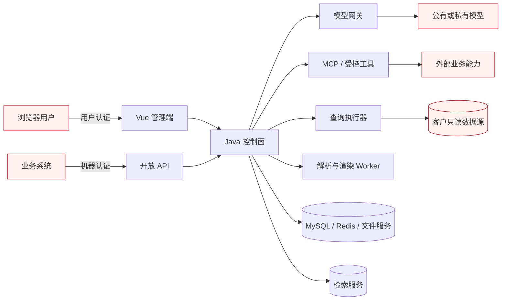

# 安全与私有化部署设计

本文定义企业 Agent 中台目标态的安全不变量和部署边界。它是设计输入，不表示现有实现已经
满足这些控制。进入编码前，必须将落地后的事实同步到现有安全文档和自动化验证中。

## 1. 信任边界

所有跨边界输入均视为不可信，包括用户 Prompt、知识文档、网页内容、模型输出、MCP 工具
描述和返回值、数据库元数据、查询结果、Webhook 以及上传文件。模型输出不是授权决策、SQL、
HTML 或工具参数的可信来源，必须经过确定性策略校验。

## 2. 主要威胁与控制

| 威胁 | 必须控制 |
| --- | --- |
| Prompt 注入与越权取数 | 系统指令和外部内容分层；工具按运行身份重新鉴权；检索先做权限过滤；引用保留来源；输出做敏感信息检查 |
| 工具滥用与副作用扩大 | 工具白名单、Schema 校验、最小权限凭证、调用预算；按只读/低风险/高风险分级；高风险操作人工批准或显式服务授权 |
| MCP 服务漂移或被替换 | 固定服务身份和传输策略；发现结果形成版本化快照；发布绑定快照；运行前健康检查；变更后重新审核和发布 |
| SSRF、DNS 重绑定和内网探测 | 出站域名/IP/CIDR 允许策略；解析后与连接时双重校验；限制重定向、协议、端口、响应大小和超时；默认禁止访问元数据地址 |
| 数据库注入与资源耗尽 | 独立只读账号；只允许登记对象；SQL AST 校验；单语句、只读事务；禁止注释、危险函数和动态文件能力；限制行数、字节、耗时和并发 |
| 模型凭证泄漏 | 凭证引用与业务配置分离；AES-GCM 加密；创建/轮换后不回显；日志、异常、Trace 和导出统一脱敏；限制解密主体和出站目的地 |
| 知识库跨权限召回 | 用户、业务系统、应用、知识库和文档的授权在检索请求中下推；禁止“召回后再过滤”；索引记录权限版本并支持撤销重建 |
| HTML 报表 XSS 与数据外送 | 仅使用审核过的模板和组件；输入符合 JSON Schema；默认转义；CSP 禁止任意脚本和外链；制品下载再次鉴权并设置有效期 |
| Webhook 伪造与重放 | HMAC 签名、时间戳、事件 ID、防重放窗口、目的地址策略、失败退避和死信；密钥支持轮换 |
| Token/成本耗尽 | 按业务系统、应用、Agent 和模型设置并发、速率、单次调用和周期预算；到限额明确拒绝或走批准后的降级策略 |
| 解析器或渲染器逃逸 | 高风险格式在隔离 Worker 中执行；非特权用户、只读根文件系统、临时目录配额、CPU/内存/超时限制、受控网络和镜像固定版本 |
| 观测数据二次泄漏 | Prompt、回复、工具参数和查询结果分级采集；默认只记录摘要和指标；正文采样需授权、脱敏、保留期和审计 |

## 3. 身份、权限与审计

### 3.1 两类入口分离

- `/admin-api/**` 沿用现有用户会话、RBAC、数据范围和 MFA 能力。
- `/open-api/v1/**` 使用独立的业务系统客户端和机器凭证，不复用管理员 Token。
- 机器凭证至少包含客户端、Scope、状态、有效期、最近使用时间和轮换版本；明文仅创建时展示一次。
- 运行身份由“业务系统客户端 + 可选终端用户声明 + 已发布 AI 应用”组成。终端用户声明只有在可信映射后才能参与授权。
- 每次外部调用记录客户端、Scope、请求 ID、幂等键、应用版本、结果状态、耗时和来源地址。

### 3.2 授权原则

- 管理操作继续使用 `domain:resource:action` 权限点；模块新增权限必须登记并有接口测试。
- 运行时不得继承平台管理员的权限。工具、知识、数据源和报表按调用主体逐项授权。
- 发布、凭证轮换、权限变更、人工审批、重跑和导出属于高风险操作，必须写入不可静默修改的审计记录。
- 禁止只依赖前端隐藏按钮、Prompt 指令或模型判断来执行授权。

## 4. 凭证与敏感数据

- 模型、数据库、MCP、Webhook 和 HTTP 工具凭证统一保存为凭证引用；领域表不得复制密文或明文。
- 每类凭证明确创建、轮换、停用、删除和应急吊销流程；使用中的版本不可直接删除。
- 加密主密钥不进入数据库、镜像或代码仓库，由部署环境提供并支持轮换演练。
- 日志框架、异常映射、事件载荷、导出和诊断包使用同一套敏感字段规则。
- Prompt、消息、知识文档、查询结果和报表制品按照现有数据分级制度标注，并配置保留期和清理任务。
- 客户可以关闭正文观测；关闭后仍保留调用计量、状态、延迟、版本和不可逆摘要。

## 5. 数据查询安全边界

数据语义层的目标是让 AI 帮助理解和选择数据，不是让模型获得数据库自由访问权。

1. 数据管理员登记只读数据源、Schema、View/表、字段和可用关系。
2. 同步元数据时只读取允许目录，不采集无关样例值；样例值采集需单独授权并脱敏。
3. LLM 生成结构化查询计划，计划引用已登记对象、字段、指标和筛选条件。
4. 平台用确定性编译器生成或校验 SQL；拒绝 DDL、DML、多语句、注释、未登记对象和危险函数。
5. 使用数据库只读账号和只读事务执行，并强制超时、最大行数、最大返回字节和并发限制。
6. 查询结果进入模型前执行字段级脱敏和大小限制；查询审计与 Agent 运行关联。

即使客户只开放 View，上述控制仍然需要。View 降低了业务表耦合和暴露面，但不替代授权、
语义定义、资源限制和审计。

## 6. 报表安全边界

- 报表计算先生成经过 Schema 校验的结构化数据，再由可信模板渲染 HTML。
- LLM 可以生成摘要、异常说明和建议，但不得直接提交可执行 JavaScript 或任意 HTML。
- 模板由管理员版本化发布，组件白名单包含表格、指标卡、受控图表和文本块。
- 动态文本默认 HTML 转义；URL、颜色、图片和富文本分别验证，不使用统一“安全字符串”绕过。
- HTML 使用严格 CSP，默认不加载公网资源；字体、图表脚本和样式随私有化镜像提供。
- PDF 若纳入选型，渲染 Worker 采用与文档解析相同的隔离原则。
- 报表预览、下载、分享和回调均再次鉴权；制品链接短期有效且不可作为永久公开地址。

## 7. 私有化部署拓扑

### 7.1 最小生产部署

| 部署单元 | 职责 | 是否必须独立进程 |
| --- | --- | --- |
| 现有 Java 应用 | 管理端 API、开放 API、领域控制面、任务协调、审计 | 是 |
| 模型网关 | 供应商协议、路由、限流、调用计量、故障标准化 | 建议独立 |
| MySQL | 业务元数据、版本、任务、调用事实和审计 | 是 |
| Redis | 缓存、短期状态、Stream 与分布式协调 | 是；不得作为唯一事实源 |
| 文件服务 | 原始文档、Workspace、报表和评估制品 | 是，可复用现有能力 |
| 检索服务 | 全文、向量、过滤和重排前候选召回 | 是 |
| 解析/渲染 Worker | 文档解析、OCR 扩展、HTML/PDF 渲染 | 高风险格式下独立 |
| 私有模型服务 | Chat、Embedding、Rerank | 客户按需部署 |

POC 允许将非核心 Worker 合并以降低开发环境成本；生产环境不能以便利为由取消安全边界。
所有可选组件必须有版本矩阵、离线镜像、许可证清单、资源基线和升级/回滚说明。

### 7.2 网络与服务身份

- 默认仅开放统一 Web/API 入口；MySQL、Redis、检索、Worker 和模型网关位于内部网络。
- 组件使用独立服务账号和最小网络权限，禁止共享管理员数据库账号。
- 出站访问默认关闭，由目的地址策略按模型、MCP、Webhook 和数据源分别放行。
- 内部调用至少使用服务凭证和请求签名；跨主机或高安全客户采用 TLS，mTLS 作为部署增强项。
- 每个组件提供存活、就绪和依赖诊断，但诊断响应不得包含凭证、Prompt 正文或数据库连接串。

## 8. 可用性、备份与恢复

- MySQL 是领域配置、版本、任务、调用事实和审计的事实源，执行状态定期检查点化。
- Redis 丢失后允许缓存降级和任务恢复，不能导致已发布定义或计费事实永久丢失。
- 原始文档与文件服务元数据纳入一致备份；检索索引必须能从文档版本和切片事实重建。
- 模型网关配置由平台事实重新下发，网关本地状态不得成为唯一配置来源。
- 定时任务采用租约和幂等键，故障切换不能重复生成报表或重复触发有副作用工具。
- 恢复演练至少覆盖：MySQL 恢复、文件恢复、索引全量重建、凭证重新注入、未完成任务处置和调用统计对账。
- 备份包本身按最高数据级别保护，恢复操作需双人复核或等效审批并完整审计。

## 9. 供应链与版本治理

- 所有 Java、Node、Python、容器和模型组件固定明确版本，禁止生产使用 `latest`。
- 构建生成 SBOM，执行依赖漏洞、许可证和镜像扫描；高危例外必须有负责人、范围、补偿控制和到期日。
- 引入 Spring AI Alibaba 前必须验证其传递依赖；已识别的旧版 Fastjson 等风险不得通过版本锁定进入产品。
- 第三方组件升级先做协议兼容、数据迁移、失败语义和回滚验证，不让供应商 SDK 类型进入核心领域模型。
- 离线安装包包含校验和、许可证、镜像清单、配置模板和部署前检查。

## 10. 实施前必须更新的现有事实文档

本设计获准进入实现时，应随对应代码在同一变更中更新：

- `docs/security/threat-model.md`：加入开放 API、模型、MCP、RAG、查询执行和报表渲染边界。
- `docs/security/data-classification.md`：加入 Prompt、消息、Embedding、调用正文、知识切片和制品。
- `docs/security/high-risk-operations.md`：加入发布、工具副作用、查询、导出、凭证轮换和恢复。
- 字段契约、数据生命周期、能力目录和删除/保留自动化验证。

在对应能力尚未实现前，不修改这些“当前事实”文档，以免把目标设计误报为已交付能力。
